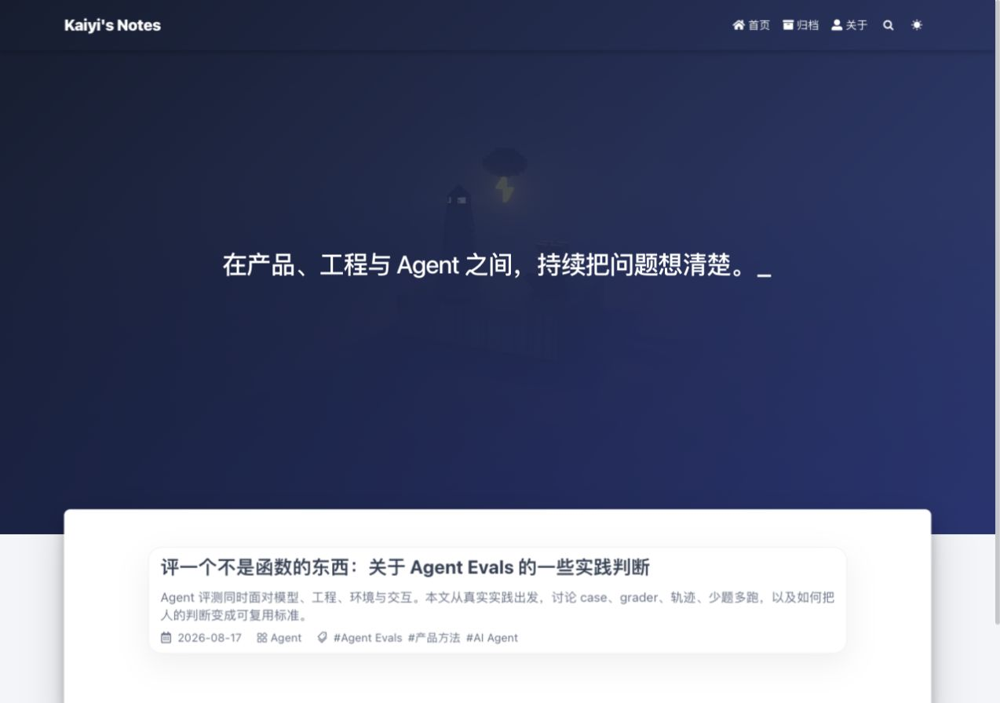
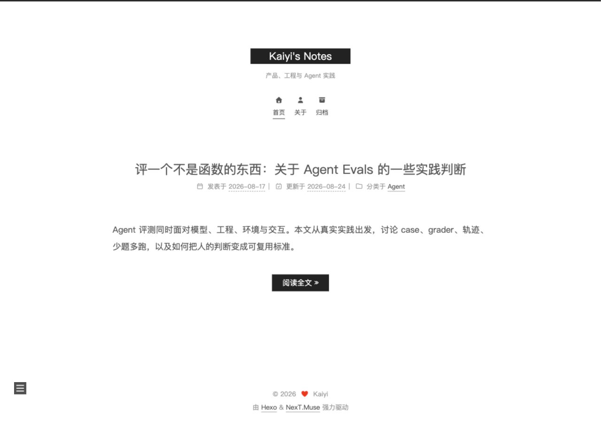
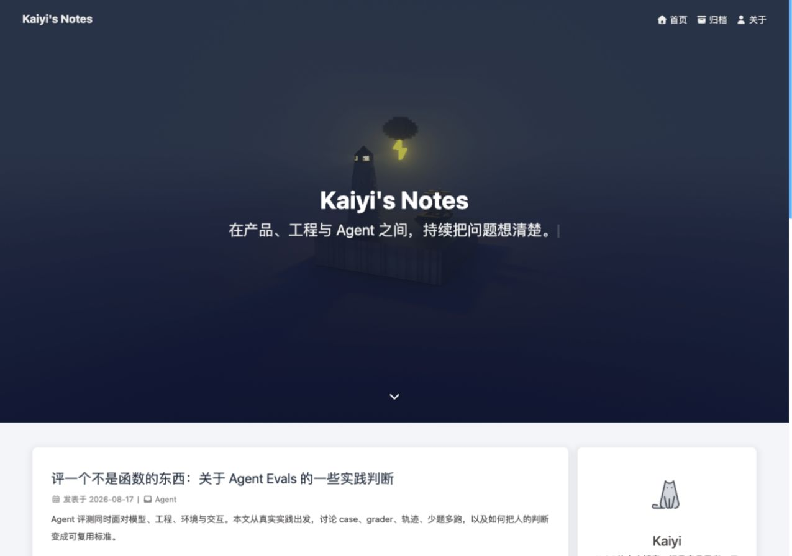

# 主题方案

这三套方案都使用同一篇文章和同一组站点文案生成，截图采用相同的桌面画布，方便直接比较布局与气质。

## Fluid（当前选择）



[Fluid](https://github.com/fluid-dev/hexo-theme-fluid) 的首页有明确的视觉识别，同时保留了舒适的文章卡片和正文宽度。它自带目录、搜索、字数与阅读时间、暗色模式等能力，很适合当前这类篇幅较长、结构较深的产品与技术文章。

选择理由：阅读体验稳定，视觉有记忆点，后续维护成本也较低。当前博客已经围绕 Fluid 完成配色、导航、首页标语和正文样式定制。

## NexT



[NexT](https://github.com/next-theme/hexo-theme-next) 的信息层级简洁，留白很多，阅读节奏接近传统独立博客。它适合希望内容长期沉淀、整体风格保持克制的站点。

## Butterfly



[Butterfly](https://github.com/jerryc127/hexo-theme-butterfly) 采用更强的卡片化结构，首页视觉更丰富，也提供侧边个人信息区。它适合希望展示更多栏目、社交信息与内容入口的个人站。

## 切换方式

在 `_config.yml` 末尾修改 `theme`：

```yaml
theme: fluid
```

可选值为 `fluid`、`next`、`butterfly`。每套主题的配置文件已经分别保存在 `_config.fluid.yml`、`_config.next.yml` 和 `_config.butterfly.yml`。修改后重新运行 `npm run dev` 即可查看。
